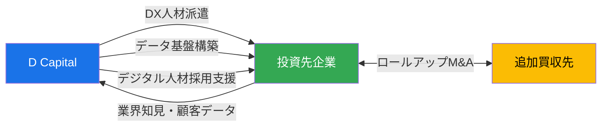
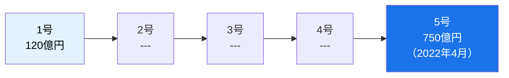
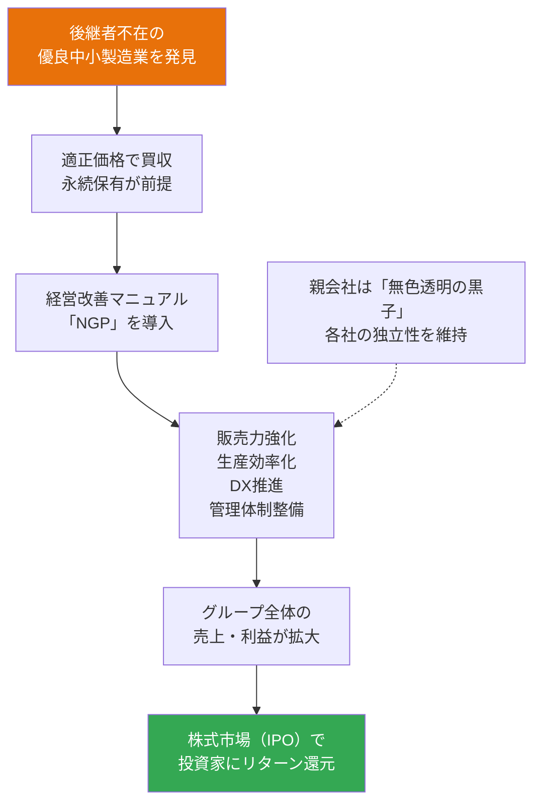
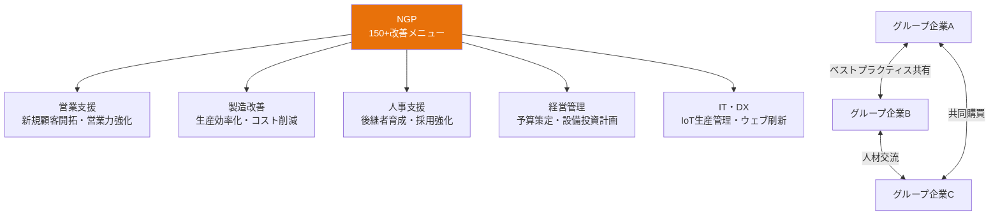
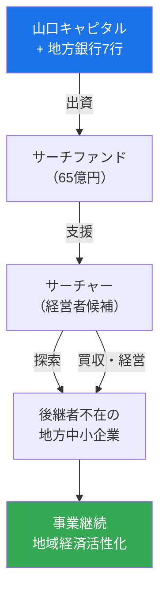
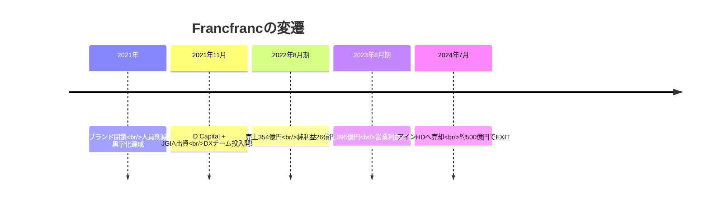
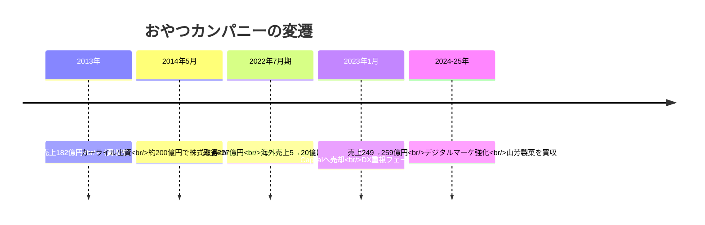
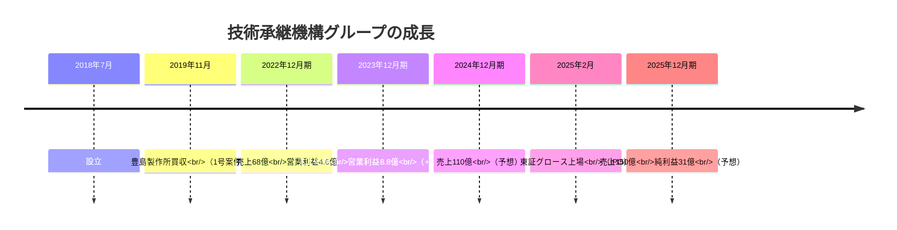
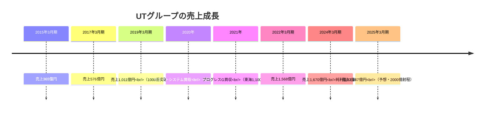
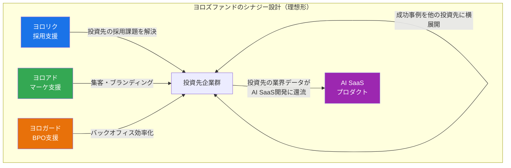

# 分析すべきファンド ── 詳細レポート

> **目的**: ヨロズファンド構想の戦略立案にあたり、ロールモデルとなるファンドの戦略・実績・組織を深く分析する
> **作成日**: 2026年2月27日

---

## 目次

1. [D Capital（ディーキャピタル）](#1-d-capital) ── DX×PE の先駆者
2. [J-STAR](#2-j-star) ── 中小企業ロールアップの王者
3. [技術承継機構](#3-技術承継機構) ── 永続保有×上場モデル
4. [くじらキャピタル](#4-くじらキャピタル) ── 小規模DXファンドの挑戦者
5. [UTグループ](#5-utグループ) ── 人材業界ロールアップの上場事例
6. [日本創生投資](#6-日本創生投資) ── 30億から始めた事業承継ファンド
7. [山口キャピタル](#7-山口キャピタル) ── 地銀発サーチファンド
8. [出資先企業の成長ケーススタディ](#8-出資先企業の成長ケーススタディ) ── 📊 詳細な成長データ
9. [YOLO'sへの示唆まとめ](#9-yolosへの示唆まとめ)

---

## 1. D Capital

> **「DX × PE」を掲げる日本初のPEファンド**
> ⭐️ **最優先で研究すべきファンド**

### 基本情報

| 項目 | 内容 |
|------|------|
| **設立** | 2021年3月 |
| **本社** | 東京 |
| **種別** | 独立系PE（バイアウト） |
| **コンセプト** | 「DX × PE」── 資本 × テクノロジー × ネットワークで中小企業を変革 |
| **1号ファンド** | 約315億円（2021年10月組成） |
| **2号ファンド** | 約670億円（2025年4月、目標超過で最終クローズ） |
| **成長倍率** | **1号→2号で2.1倍** |

### 代表・チーム

| 役職 | 氏名 | 経歴 |
|------|------|------|
| **代表パートナー** | 仁木 準 | — |
| **代表パートナー** | 木畑 宏一 | — |
| **代表パートナー** | 梅津 直人 | 2021年の会社設立に携わる |
| **CDO/パートナー** | 松谷 恵 | デジタル領域統括 |

> [!IMPORTANT]
> **D Capital最大の特徴は「自前のDXチーム」を組織内に持っている**こと。外部コンサルに丸投げせず、投資先に直接DX人材を送り込む。これがYOLO'sの「自社サービス群で直接バリューアップ」と同じ発想。

### 主要投資先

| 企業名 | 業種 | 投資時期 | バリューアップ内容 | EXIT |
|--------|------|---------|----------------|------|
| **Francfranc** | 家具・インテリア小売 | 2021年11月 | ECチャネル強化、DX推進 | **2024年7月 EXIT済** |
| **おやつカンパニー** | 菓子製造 | 2023年1月（カーライルから取得） | デジタルマーケ強化、EC拡大、山芳製菓を買収（ロールアップ） | 保有中 |
| **カバヤ食品** | 菓子・食品製造 | — | — | 保有中 |
| **日本教育協会** | 個別指導学習塾 | — | 採用DX、デジタルマーケ | 保有中 |
| **ウィルホールディングス** | 訪問看護 | — | — | 保有中 |
| **カタリナマーケティングジャパン** | マーケティング | — | — | 保有中 |
| **エフシースタンダードロジックス** | 国際物流 | — | — | 保有中 |

### YOLO'sとの比較

```
【D Capital】                      【YOLO's（ヨロズファンド構想）】
━━━━━━━━━━━━━━━━━━━━━━━━━━━━━━━━━━━━━━━━━━━━━━━━━━━━
コンセプト: DX × PE               マーケ × 採用 × BPO × PE
DXチーム: 社内に保有 ✓             自社サービス群を保有 ✓  ← より強い
1号規模: 315億円                   目標: 100億（AUM）
投資先規模: 中堅〜大企業           中小企業（事業承継）
業種: 業種横断                     業種横断（予定）
EXIT: 売却型                       売却型
━━━━━━━━━━━━━━━━━━━━━━━━━━━━━━━━━━━━━━━━━━━━━━━━━━━━
差別化ポイント: YOLO'sは「DX」だけでなく
「採用」「マーケ」「バックオフィス」まで自社で完結できる
→ D Capitalより深いハンズオンが可能
```

### 🔗 ファンド × 出資先のシナジー創出



| シナジーの種類 | 具体的な施策 | 事例 |
|--------------|------------|------|
| **DXチーム派遣** | 自前のDX専門人材を投資先に常駐・伴走させる | Francfrancへの EC/アプリ改善チーム派遣 |
| **データ基盤構築** | 眠っているデータを活用した経営効率化 | おやつカンパニーの販売データ活用 |
| **デジタル人材の採用支援** | 投資先の持続的成長のため、デジタル人材の採用まで支援 | 各投資先に展開 |
| **ポートフォリオ間ロールアップ** | 投資先を核に同業他社を追加買収、ブランド力を統合 | おやつカンパニー → 山芳製菓を買収 |
| **EXIT時のシナジー設計** | 売却先とのシナジーを設計してEXIT価値を最大化 | Francfranc → アインHD（店舗・顧客層の補完） |

> [!NOTE]
> **D Capitalの特徴的なシナジー：「DX × ロールアップ」の二刀流**
> おやつカンパニーでは、DX（デジタルマーケ・EC拡大）でオーガニック成長させながら、山芳製菓を買収して「ベビースターブランド × わさビーフ」のブランドポートフォリオを構築。単なるDX支援ではなく、M&Aによる非連続成長も同時に推進している。

### 学ぶべきポイント

1. **「DX × PE」というシンプルなブランディング** → LP向けの説明が1行で終わる
2. **自前チームの組成方法** → 投資チームとは別に、DX専門チームを内製化
3. **315億→670億の成長プロセス** → Francfrancの成功EXIT実績が2号ファンドの呼び水に
4. **おやつカンパニーでのロールアップ**（山芳製菓を追加買収）→ DX＋ロールアップの組み合わせ

---

## 2. J-STAR

> **国内最多の投資件数を誇る中小企業特化PE**
> ⭐️ 「120億→750億」の成長軌跡が最大の教科書

### 基本情報

| 項目 | 内容 |
|------|------|
| **設立** | 2006年頃 |
| **本社** | 東京 |
| **種別** | 独立系PE（ミッド・スモールキャップ特化） |
| **コンセプト** | 「課題解決型投資」── ソリューション・キャピタル |
| **代表** | 原 禄郎（代表取締役） |
| **取締役パートナー** | 櫻井 秀秋、湯本 達也 |

### ファンド成長の軌跡



> **1号の120億円 → 5号の750億円 = 約6.3倍の成長**
> 5号は目標650億に対し**750億で最終クローズ**（オーバーサブスクライブ）

### 投資テーマ

| テーマ | 説明 |
|--------|------|
| **事業承継** | 後継者不在の中小企業を買収・バリューアップ |
| **MBO** | 経営陣による自社買収を支援 |
| **カーブアウト** | 大企業の非コア事業を切り出して独立化 |
| **事業撤退支援** | 株主による事業撤退をサポート |

### 主要投資先（抜粋）

| 企業名 | 業種 | 特徴 |
|--------|------|------|
| **アイセイ薬局** | 調剤薬局・介護 | 非公開化（TOB）→ 中期ビジョン策定 |
| **ケアギバー・ジャパン** | 介護（有料老人ホーム） | ロールアップで施設数拡大 |
| **プラティア** | 介護（グループホーム） | 他のGH事業者をM&Aで拡大 |
| **jinjer** | HR SaaS | HR関連SaaSプラットフォーム |
| **堀内機械** | 製造（油圧シリンダー） | 事業承継案件 |
| **シニアライフクリエイト** | 飲食（高齢者宅配弁当） | チェーン展開 |
| **caname** | パーソナルジム | — |
| **ジャパンウェイスト** | 産業廃棄物 | — |
| **Jステップホールディングス** | 建設（足場施工） | — |
| **トイファクトリー** | キャンピングカー製造 | — |

### EXIT実績

- **プリマジェスト社の売却**でグロスIRR **50%超**を達成（2号ファンド）
- EXIT手法：MBO、トレードセール（事業売却）

### 🔗 ファンド × 出資先のシナジー創出

| シナジーの種類 | 具体的な施策 | 事例 |
|--------------|------------|------|
| **自社開発DXツールの横展開** | 介護施設向け管理アプリ「グッジョブ！」を自社開発し、投資先に導入 | ケアギバー・ジャパンで利用者情報・勤務シフト・日次収益を一括管理 |
| **ポートフォリオ企業の経営統合** | 同業種の複数投資先を統合して規模拡大 | サンワグループ+シンシア+新日本開発HD+ハリタ金属 → **レナタス**を形成 |
| **共同投資パートナーとの専門性補完** | 共同投資により、自社にない知見を取り込む | jinjerへの投資でPotentia Capital（テック専門）と協業 |
| **ロールアップによる施設拡大** | プラットフォーム企業を核に、小規模事業者を追加買収 | ケアギバー（有料老人ホーム）・プラティア（グループホーム）で施設数拡大 |
| **業界特化のバリューアップ** | 非公開化により短期業績プレッシャーを排除、中期戦略に集中 | アイセイ薬局のTOB → 医療モール開発・薬剤師マネジメントに経営資源集中 |

> [!NOTE]
> **J-STARの特徴的なシナジー：「ポートフォリオ統合」**
> 2023年に投資先4社（サンワグループ・シンシア・新日本開発HD・ハリタ金属）を経営統合して**レナタス**を形成。個別投資先を超えたグループ統合により、スケールメリットとクロスセルを実現。また、ケアギバー・ジャパンでは自社開発アプリ「グッジョブ！」で介護DXを推進し、属人的な施設運営を「見える化」した。

### 学ぶべきポイント

1. **「課題解決型投資」というポジショニング** → バイアウトではなく「ソリューション」と言い換えている
2. **圧倒的な投資件数で実績を積み上げる戦略** → 量が質を担保
3. **多業種×中小企業** → 特定業種に偏らず、サイズで切る戦略
4. **介護・調剤薬局でのロールアップノウハウ** → パターンAの直接的な教科書
5. **保有期間3〜7年** → EXIT計画の組み方

---

## 3. 技術承継機構

> **「売らない」PEファンド → 上場で回収する革新モデル**
> ⭐️ EXIT戦略の新しい選択肢として必見

### 基本情報

| 項目 | 内容 |
|------|------|
| **正式名称** | 株式会社技術承継機構（Next Generation Technology Group Inc.） |
| **設立** | 2018年7月 |
| **代表** | 新居 英一（代表取締役社長） |
| **上場** | 2025年2月5日 東証グロース市場（2025年最初のIPO銘柄） |
| **グループ企業数** | 18社 |
| **コンセプト** | 技術を次世代に繋ぐ「永続保有型」事業承継 |

### 財務データ

| 指標 | 2024年12月期 | 2025年12月期（予想） | 成長率 |
|------|-------------|-------------------|--------|
| **連結売上高** | 110.5億円 | 149.6億円 | **+35.4%** |
| **連結純利益** | 9.0億円 | 30.9億円 | **+243.0%** |

### ビジネスモデル



> [!IMPORTANT]
> **最大の特徴：「永続保有」＝ 買収した会社を売却しない**
> 一般的なPEファンドとは根本的に異なるモデル。投資家へのリターンは**株式市場（上場）を通じて**還元する。
> 米国ダナハー社のビジネスシステムをモデルとした独自手法「NGP（NGTG Growth Program）」を使用。

### グループ企業（一部）

| 企業名 | 事業内容 |
|--------|---------|
| 豊島製作所 | 製造業 |
| 東洋マーク | 製造業 |
| FAシンカテクノロジー | FA関連 |
| エムエスシー製造 | 製造業 |
| 篠原製作所 | 製造業 |
| 京和精工 | 精密加工 |
| キンポーメルテック | 製造業 |
| エアロクラフトジャパン | 航空関連 |
| 天鳥 | 製造業 |
| ティオック | 製造業 |

### 🔗 ファンド × 出資先のシナジー創出

**NGP（NGTG Growth Program）── 150以上の改善メニューによる体系的バリューアップ**



| シナジーの種類 | 具体的な施策 | 効果 |
|--------------|------------|------|
| **NGP（経営改善プログラム）** | 営業・開発・人事・管理・ITの5分野×150+メニューから最適な施策を選択 | 各社の課題に合わせたカスタマイズ型支援 |
| **ベストプラクティス共有** | グループ内の成功事例を他社に横展開、定期交流会を実施 | 営業から従業員教育まで相互に高め合う関係構築 |
| **共同購買** | 18社のスケールメリットを活かした原材料・備品の一括購入 | 購買コスト5〜15%削減 |
| **人材交流** | グループ間の経営幹部出向、後継者育成プログラム | 組織力強化・後継者不足の解消 |
| **IT・IoT推進** | 豊島製作所でウェブ刷新（検索上位表示）・IoT生産管理システム開発 | 製造効率の改善・新規案件獲得 |

> [!NOTE]
> **技術承継機構の特徴的なシナジー：「ダナハー型の仕組み化」**
> 米国ダナハー社のDBS（Danaher Business System）をモデルに、NGPという体系的な改善プログラムを構築。ポイントは**「押し付けない」**こと。各社の自主性を尊重しながら、150+メニューから必要な施策を選択させる。グループ全体での案件多様化により個社の業績変動を吸収し、安定成長を実現。

### 学ぶべきポイント

1. **「売らない」という逆張りのポジショニング** → 売り手企業からの信頼が圧倒的に高い
2. **上場によるEXIT** → ファンド（＝期限あり）ではなく事業会社として上場する発想
3. **NGP（経営改善マニュアル）の標準化** → バリューアップ手法をマニュアル化して横展開
4. **年間売上150億・利益30億**（予想）→ 18社でこの規模感が参考になる
5. **「無色透明の黒子」哲学** → 被買収企業の文化を壊さない統合手法

---

## 4. くじらキャピタル

> **小規模DXファンドの挑戦者 ── YOLO'sのサイズ感に最も近い**

### 基本情報

| 項目 | 内容 |
|------|------|
| **正式名称** | くじらキャピタル株式会社（Quzilla Capital, Inc.） |
| **設立** | 2018年4月 |
| **代表** | 竹内 真二（共同創業者・代表取締役） |
| **経歴** | リーマン・ブラザーズ → モルガン・スタンレー → IMJ（アクセンチュア）再建 |
| **コンセプト** | 「デジタル時代のバイアウトファンド」── DXで中小企業を再成長 |
| **AUM** | 非公開（小〜中規模と推定） |

### 受賞・評価

- **Financial Services Review「2023年 日本のPE トップ5」**に選定
- **2022年版「中小企業白書」**（中小企業庁）に投資事例が掲載

### 投資先

| 企業名 | 業種 | 状況 |
|--------|------|------|
| **アーバンビルシステム** | ビル管理・清掃 | 保有中 |
| **金井酒造店** | 酒蔵（神奈川） | **2023年1月 EXIT済**（ココハダLABへ売却） |

### 🔗 ファンド × 出資先のシナジー創出

| シナジーの種類 | 具体的な施策 | 事例 |
|--------------|------------|------|
| **紙文化からの脱却** | 稼働管理・業務報告をデジタル化 | アーバンビルシステム（UBS）のビル管理業務 |
| **人材業務のデジタル移行** | 採用・教育・定着プロセスをデジタル化 | UBSの従業員管理 |
| **バックオフィスSaaS化** | 各種バックオフィス業務をSaaSに移行 | UBSの業務効率化 |
| **経営管理ツール導入** | クラウド型経営管理ツール「board」導入 | 受発注管理体制の確立、フロント×バックのコミュニケーション改善 |
| **人材相互活用** | UBS代表がくじらキャピタルのCTOを兼務 | 投資先の現場知見がファンドのDX戦略に還流 |
| **成功事例の横展開** | UBSでの「board」導入成功を同業他社への支援モデルに | ビルメンテナンス業界全体への展開を計画 |

> [!NOTE]
> **くじらキャピタルの特徴的なシナジー：「100%デジタル再建」**
> 竹内代表は「企業を100%デジタルで再建する」というアプローチを掲げ、UBSでは紙文化→SaaS化→経営管理ツール導入と段階的にDXを推進。特筆すべきは**UBS代表がくじらキャピタルのCTOを兼務**している点。投資先の現場知見がファンドの戦略に直接フィードバックされる双方向のシナジー構造を実現。

### 学ぶべきポイント

1. **リーマン・モルスタ出身者が「中小企業DX」に振り切った** → 大手出身のキャリアチェンジ事例
2. **小規模でも「トップ5」に選ばれる** → 戦略の明確さが評価の決め手
3. **中小企業白書に掲載** → 政府のお墨付きが信用力に
4. **酒蔵への投資と売却** → ニッチ分野でもDXが効くことの実証

> [!TIP]
> くじらキャピタルの規模感は**YOLO'sが最初に目指すべきサイズ**に最も近い。「大きくなってから」ではなく「小さいまま実績を作る」参考になる。

---

## 5. UTグループ

> **人材業界ロールアップの上場モデル ── パターンCの到達イメージ**

### 基本情報

| 項目 | 内容 |
|------|------|
| **種別** | 上場企業（東証プライム） |
| **主力事業** | 製造業向け人材派遣 |
| **特徴** | 正社員雇用による派遣を業界に先駆けて導入 |
| **成長実績** | **14期連続増収**（2023年3月期まで） |

### M&A・ロールアップ戦略

| 買収先 | 時期 | 地域 | 目的 |
|--------|------|------|------|
| **サポート・システム** | 2020年1月 | 関西（大阪） | 製造業派遣の地域拡大 |
| **Green Speed（ベトナム）** | 2020年2月 | ベトナム | 海外展開・ベトナム製造業 |
| **プログレスグループ** | 2021年4月 | 東海（愛知） | 自動車・電子部品向け拡大 |
| **その他10社以上** | 中計期間中 | 各地 | 地域キャリアプラットフォーム構築 |

### 戦略の特徴

```
UTグループの「キャリアプラットフォーム」戦略
━━━━━━━━━━━━━━━━━━━━━━━━━━━━━━━━━━━
① 地域の有力人材会社をM&Aで取得（ロールアップ）
     ↓
② ガバナンス強化 → グループシナジー創出
     ↓
③ 事業を4タイプに再定義して最適配分
   ・モーター事業（自動車）
   ・セミコンダクター事業（半導体）
   ・エージェント事業（紹介）
   ・ネクストキャリア事業（再就職支援）
     ↓
④ 企業横断での労働力の最適配分
     ↓
⑤ 「はたらく人」の定着率UP → 生産性UP → 売上UP
```

### 🔗 ファンド × 出資先のシナジー創出

| シナジーの種類 | 具体的な施策 | 効果 |
|--------------|------------|------|
| **「One UT」制度** | グループ内転職制度。従業員がグループ内の異なる企業・職種にキャリアチェンジ可能 | 離職防止・人材リテンション・キャリア形成 |
| **採用力×営業力のシナジー** | M&A後にグループ全体の採用チャネルと営業ネットワークを統合 | 買収初期から早期シナジー実現 |
| **3階建て教育制度** | 就業基礎力→専門スキル→応用力の3段階教育を全グループに展開 | 人材の質向上・生産性UP |
| **職場選択制度** | 従業員が全国のグループ内から希望職場を選択可能 | 定着率向上・ミスマッチ防止 |
| **労働力の最適配分** | ネクストキャリア事業部門で企業横断の人材配置を最適化 | 繁閑差の吸収・稼働率向上 |
| **サービスのクロスセル** | 顧客企業に派遣・請負・紹介の複数サービスを提供 | 顧客単価UP・LTV向上 |

> [!NOTE]
> **UTグループの特徴的なシナジー：「人材のプラットフォーム化」**
> M&Aで取得した各社の「人材プール」をone platformとして運用する発想。「One UT」制度で従業員がグループ内を自由に異動でき、「職場選択制度」で全国のグループ企業から希望先を選べる。これにより**「買収＝人材プール拡大」**という構造が成立し、スケールするほど人材のマッチング精度が上がる正のフィードバックループを形成。

### 学ぶべきポイント

1. **地域×専門職でのロールアップ** → 「東海の製造業派遣」のように切り取る
2. **「正社員雇用」という差別化** → 派遣社員のロイヤルティを上げ、離職率を下げる
3. **14期連続増収** → M&Aを成長エンジンとして組み込んだ経営
4. **事業ポートフォリオの再定義** → 買収後にグループ全体を4セグメントに整理
5. **パターンC（HR垂直統合）の上場モデル** → YOLO'sが目指す数年後の姿

---

## 6. 日本創生投資

> **30億円から始めた事業承継ファンド ── 最小スタートの教科書**

### 基本情報

| 項目 | 内容 |
|------|------|
| **設立** | 2016年4月 |
| **代表** | 三戸 政和 |
| **著書** | 『サラリーマンは300万円で小さな会社を買いなさい』 |
| **コンセプト** | 地方創生 × 中小企業 × 事業承継・事業再生 |
| **1号ファンド** | 30億円 |
| **チーム** | VC出身者 × バイアウトファンド出身者のハイブリッド |

### 戦略の特徴

| 特徴 | 内容 |
|------|------|
| **「ハイブリッドファンド」** | VCの成長支援力 × バイアウトの経営改善力を融合 |
| **地方創生との連携** | 地方の中小企業に特化 |
| **ロールアップ実行** | 資本提携先ウェルフォースを通じて介護分野で2件のロールアップM&A |
| **情報発信力** | 代表の三戸氏がベストセラー著者 → ファンドの認知度向上に貢献 |

### 投資先

| 企業名 | 業種 |
|--------|------|
| **パパママハウス** | デザイナーズハウス販売 |
| **ウェルフォース** | 介護（ロールアップ母体） |

### 学ぶべきポイント

1. **30億円という現実的なスタート** → 100億でなくても始められる
2. **著書によるブランディング** → 「300万円で会社を買え」が社会的認知を獲得
3. **VC × バイアウトのハイブリッド** → YOLO'sも類似のアプローチが可能
4. **介護分野でのロールアップ実行** → 小規模ファンドでもロールアップはできる

---

## 7. 山口キャピタル

> **地銀発サーチファンド ── 地域金融機関との連携モデル**

### 基本情報

| 項目 | 内容 |
|------|------|
| **設立** | 1996年 |
| **親会社** | 山口フィナンシャルグループ |
| **種別** | 地域密着型VC＋サーチファンド |
| **サーチファンド開始** | 2019年2月 |
| **運用規模** | 約65億円（サーチファンド） |

### サーチファンドの仕組み



### 特徴

| 特徴 | 内容 |
|------|------|
| **地銀7行との協働** | 2022年2月に2号ファンド設立。地銀ネットワークで案件発掘 |
| **エコシステム構築** | 都市部の優秀な若手人材を地方企業に送り込む仕組み |
| **社会課題解決型** | 後継者不在 × 若手人材不足 × 地域経済低迷を同時に解決 |

### 学ぶべきポイント

1. **地銀をアンカーLPにする手法** → YOLO'sも地域金融機関との連携を検討すべき
2. **サーチファンドモデル** → 経営者候補の確保と育成の仕組み
3. **65億円規模での運用** → 現実的なサイズ感
4. **「社会課題解決」の文脈** → 政策支援（中小機構、自治体）を引き出しやすい

---

## 8. 出資先企業の成長ケーススタディ

> **各ファンドの代表的な投資先が、どのように出資を受け、資本をどう使って業績を伸ばしたかの詳細分析**

### Case 1: Francfranc × D Capital ── DXで企業価値を2.7年で約500億に引き上げた事例



| フェーズ | 内容 | 定量効果 |
|---------|------|---------|
| **① 出資の経緯** | 創業者退任後、経営改革中のFrancfrancにD Capital + JGIA（日本成長投資アライアンス）が共同出資 | — |
| **② 資本の使い方：EC/データ基盤** | Dynamics 365をMA基盤として導入。オムニチャネルのデータ統合 | MAコスト**1/3に削減** |
| **③ 資本の使い方：データサイエンス** | JDSCと協業しEC顧客のLTV向上プロジェクト実施 | 顧客購入率**60〜217%改善**、対象セグメント売上**19〜100%増** |
| **④ 資本の使い方：DX人材** | D Capitalの自前DXチームを常駐させ、ECとアプリの使い勝手を改善 | EC/アプリ経由の売上向上 |
| **⑤ EXIT設計** | アインHD（アインズ＆トルぺ）への売却。店舗立地・顧客層は類似するが販売カテゴリーが異なるため補完関係 | **約499.8億円で売却** |

> [!IMPORTANT]
> **YOLO'sへの示唆**：Francfranc事例は「DXによるオーガニック成長 → 戦略的売却先とのシナジー設計」という理想的なEXITパターン。YOLO'sがヨロアド（マーケ）を投資先に導入して売上を伸ばし、戦略的バイヤーにEXITする際の直接的な参考になる。

---

### Case 2: おやつカンパニー × カーライル → D Capital ── 2段階ファンドで10年成長



| フェーズ | 内容 | 定量効果 |
|---------|------|---------|
| **① カーライルの出資（2014年）** | 株式の約70%を約200億円で取得。グローバルネットワークを活用した海外展開が目的 | — |
| **② 資本の使い方：海外展開** | カーライルの海外ネットワークで東南アジア・北米に進出 | 海外売上**5〜6億 → 約20億（3倍以上）** |
| **③ 資本の使い方：新商品開発** | 「BODY STARプロテインスナック」「おやつサプリ」等、健康カテゴリーに進出 | 新カテゴリー開拓 |
| **④ D Capitalへの承継（2023年）** | カーライルから全株式をD Capitalに譲渡。DX重視の新フェーズへ | — |
| **⑤ 資本の使い方：デジタルマーケ** | DELISH KITCHENでのレシピ動画プロモーション。年間約30件の異業種コラボ | 店頭売上**前年比110%超** |
| **⑥ ロールアップ：山芳製菓買収** | 「ベビースター」×「わさビーフ」のブランドポートフォリオ構築 | スナック菓子市場での新ポジション |
| **⑦ 最新業績** | 連結総売上高が260億円規模に成長 | 売上**182億→259億（+42%・10年間）** |

> [!NOTE]
> **2段階ファンドモデルの教訓**：カーライル（グローバル展開フェーズ） → D Capital（DXフェーズ）と、成長ステージに合わせてファンドが交代するモデル。小規模ファンドが最初に投資し、成長後に大手に売却するEXIT戦略としても参考になる。

---

### Case 3: 技術承継機構グループ ── 18社を買収し売上68億→150億に成長



**豊島製作所（1号案件）の成長ストーリー：**

| フェーズ | 内容 | 定量効果 |
|---------|------|---------|
| **① 買収の経緯** | 後継者不在の冷間鍛造メーカー（従業員250名、タイ子会社あり）を永続保有前提で買収 | — |
| **② 資本の使い方：営業DX** | ウェブサイト刷新 → 「冷間鍛造」で検索上位表示達成 | サイト訪問者・問い合わせ**増加** |
| **③ 資本の使い方：製造DX** | IoT生産管理システムを自社開発。中間在庫含むリアルタイム把握 + AI画像検査装置導入 | **製造効率改善・原価削減** |
| **④ 資本の使い方：組織改革** | 全250名と個別面談、人事評価制度導入、チャットツール・クラウドストレージ導入 | オーナー経営→**チーム経営へ移行** |
| **⑤ 資本の使い方：採用強化** | 新卒・中途採用を強化、教育制度拡充 | 人材不足の解消 |
| **⑥ 資本の使い方：値上げ** | 既存商品の原価分析に基づく値上げ実施 | **利益率改善** |

> [!IMPORTANT]
> **YOLO'sへの示唆**：技術承継機構の成功は「NGPの仕組み化」に尽きる。営業DX・製造DX・組織改革・採用強化・値上げという**5つのレバー**を体系的に横展開している。YOLO'sも「ヨロリク（採用）+ ヨロアド（営業DX）+ ヨロガード（バックオフィス）+ 値上げコンサル」を標準メニュー化すべき。

---

### Case 4: jinjer × J-STAR + Potentia Capital ── SaaS企業のバイアウト成長

| フェーズ | 内容 | 定量効果 |
|---------|------|---------|
| **① シリーズ調達** | 2022年3月、TybourneをリードにSBIグループ等から資金調達 | **総額約51億円** |
| **② プロダクト成長** | HR統合プラットフォーム「ジンジャー」を展開。人事・給与・就業管理を一体化 | 累計導入社数**18,000社超** |
| **③ バイアウト（2024年9月）** | J-STAR + Potentia Capital（豪）が全株式を共同取得 | — |
| **④ 資本の使い方** | Potentiaのテック知見 × J-STARの日本市場経験で、プロダクト磨き込み・イノベーション・顧客サポート強化 | — |
| **⑤ 市場ポジション** | 従業員100〜300名企業の人事管理市場でシェア**No.1**（22.6%、2年連続） | **ベンダー別売上金額シェア1位** |
| **⑥ 成長戦略** | NRR（ネットリテンションレート）向上を重点戦略に。既存顧客からの収益拡大を追求 | — |

> [!NOTE]
> **SaaS × PE の組み合わせ**：jinjerはVCステージ（51億調達）を経てPEバイアウトされた事例。J-STARの「バイ・アンド・ビルド」戦略により、今後は同業SaaS企業の追加買収による機能拡充も見込まれる。YOLO'sが将来AI SaaSプロダクトを開発した際の成長モデルとして参考になる。

---

### Case 5: UTグループ ── 売上365億→1,947億を実現した人材ロールアップ



| 指標 | 2015年 | 2024年 | 成長倍率 |
|------|--------|--------|---------|
| **売上高** | 365億円 | 1,670億円 | **4.6倍** |
| **従業員数** | — | 36,344名 | — |
| **純利益** | — | 92億円 | — |

**M&Aによる成長の具体例：**

| 買収先 | 取得時期 | 効果 |
|--------|---------|------|
| **サポート・システム** | 2020年1月 | 関西・関東の顧客基盤と、UTの採用・人材育成基盤を融合 |
| **プログレスグループ** | 2021年4月 | 愛知中心に約**1,100名の派遣社員**を取得。自動車・電子部品向け強化 |
| **その他10社以上** | 中計期間中 | 地域キャリアプラットフォーム構築。エリア事業の従業員数が大幅増 |

> [!IMPORTANT]
> **YOLO'sへの示唆**：UTグループの成功方程式は「M&A（人材プール拡大）× 統合制度（One UT）× 教育制度（3階建て）」。人材業界は**「買収＝即座に売上が立つ」**という特性があり、ロールアップとの親和性が極めて高い。YOLO'sがパターンC（HR垂直統合）を選択した場合の到達イメージ。

---

### Case 6: 金井酒造店 × くじらキャピタル ── 1億円規模で酒蔵を再建、1.3年でEXIT

> ⭐️ **YOLO'sの初期投資に最も近い事例**

| フェーズ | 内容 | 定量効果 |
|---------|------|---------|
| **① 買収の経緯（2021年10月）** | 明治元年創業・神奈川県秦野市の酒蔵。後継者不在でくじらキャピタルが吸収分割で取得 | 資本金**1億100万円** |
| **② 資本の使い方：EC即日立ち上げ** | **M&A実行当日にECサイトを開設**。SNS運用も即開始 | EC売上が総売上の**10%**に |
| **③ 資本の使い方：リブランディング** | 商品・コーポレートのリブランディング、新商品開発 | ブランド価値向上 |
| **④ 資本の使い方：バックオフィスDX** | 会計クラウド・EC連動POSレジ導入、営業販路開拓 | 業務効率化 |
| **⑤ 資本の使い方：醸造IoT** | 醸造工程へのIoT実験導入 | 品質管理の向上 |
| **⑥ 業績改善** | わずか1年で大幅な業績改善 | 売上**前年比+20%超**、営業赤字**半減** |
| **⑦ EXIT（2023年1月）** | 全株式をココハダLAB（地方創生企業）に譲渡 | **約1年3ヶ月でEXIT完了** |

> [!IMPORTANT]
> **YOLO'sへの最重要示唆**：金井酒造店はYOLO'sが初期に手がけるべき投資サイズ・スピード感に最も近い。特に「**M&A当日にECサイト立ち上げ**」「**SNS即日運用開始**」というスピード感は、ヨロアド（マーケ）がそのまま実行できる施策。1億円規模の投資で売上+20%・赤字半減を1年で達成し、1.3年でEXITした回転の速さが参考になる。

---

### Case 7: パパママハウス × 日本創生投資 ── 年商20億の住宅会社をウェブマーケでバリューアップ

| フェーズ | 内容 | 定量効果 |
|---------|------|---------|
| **① 買収の経緯** | 日本創生投資の**第1号案件**。名古屋のデザイナーズハウス販売会社を事業承継で取得 | 企業価値**1〜30億円**レンジ |
| **② 投資時の企業規模** | 愛知県名古屋市のデザイナーズハウス販売 | 年商**約20億円** |
| **③ 資本の使い方：ウェブマーケ** | SEO対策、リスティング広告などのウェブマーケティングをハンズオンで支援 | 集客力向上 |
| **④ 資本の使い方：経営管理強化** | 経営管理体制の整備・強化 | 利益拡大 |
| **⑤ EXIT：MBO** | 計画通り、経営陣への株式譲渡（MBO）を完了 | **経営陣が独立して経営継続** |

> [!NOTE]
> **「ウェブマーケ×経営管理」で利益を伸ばしてMBO EXIT**：YOLO'sのヨロアド（マーケ）による支援モデルそのもの。SEO・リスティング広告という具体的な施策で集客→売上を伸ばし、経営管理でコストを最適化。MBOによるEXITは、経営者候補がいる場合の選択肢として重要。

---

### Case 8: UNICONホールディングス × エンデバー・ユナイテッド ── 小規模ゼネコン4社を統合して売上156億

| フェーズ | 内容 | 定量効果 |
|---------|------|---------|
| **① 買収・統合の経緯** | 地方の中小ゼネコン4社を段階的にM&A（2019年〜） | 各社は数十億規模 |
| **② 統合先企業** | 山和建設 + 小野中村 + 南会西部建設コーポレーション + 南総建 | **4社を経営統合** |
| **③ 資本の使い方：グループ化** | 「地域連合型ゼネコン」として UNICONホールディングスを設立 | 統合後売上**約156億円** |
| **④ 資本の使い方：受注力強化** | 中規模案件への入札が可能に。県域を超えた連携で受注安定化 | 個社では不可能だった**大型案件受注** |
| **⑤ 資本の使い方：採用・制度** | コーポレートブランド確立で採用力強化。人事制度・安全管理体制の整備 | 技術者不足の解消 |
| **⑥ バリューアップ** | ガバナンス強化、次世代経営体制の構築 | 企業価値向上 |

> [!NOTE]
> **小規模企業のロールアップモデル**：個社では年商数十億だった地方ゼネコンが、4社統合で156億円規模に成長。「国の企業集団制度を活用した技術者配置の効率化」という規制活用もポイント。YOLO'sが人材・サービス業界で同様のロールアップを行う場合の直接的な参考。

---

### Case 9: ヨシムラ・フード・ホールディングス ── 個人M&Aから上場企業へ

| フェーズ | 内容 | 定量効果 |
|---------|------|---------|
| **① 創業の経緯** | 代表の吉村元久氏が**個人で食品会社を買収・黒字化**したことが原点 | 個人M&Aからスタート |
| **② ビジネスモデル** | 後継者不足の中小食品メーカーをM&Aで取得。「事業承継プラットフォーム」として連続的にロールアップ | **食品特化のロールアップ** |
| **③ 上場** | 東証に上場し、事業承継プラットフォーム戦略を加速 | **上場企業に成長** |
| **④ 成功要因** | 「会社を売る」ではなく「託す」。経営者の引退後も企業文化・雇用を守る | 売り手オーナーの信頼獲得 |
| **⑤ 個人M&Aとの関連** | 吉村氏の著書・メディア露出がブランド構築に貢献 | 案件ソーシング力向上 |

> [!IMPORTANT]
> **YOLO'sへの示唆**：ヨシムラフードHDは「**個人M&A → 連続買収 → 上場**」という成長軌跡が技術承継機構と類似。違いは**食品業界に特化**したこと。「売らずに託す」というメッセージングも技術承継機構と共通。YOLO'sが特定業界に絞ったロールアップを行う際のロードマップとして参考になる。

---

### 成長パターンの比較まとめ

| ケース | 投資規模 | 売上成長 | 成長ドライバー | EXIT方法 |
|--------|---------|---------|-------------|---------|
| **Francfranc** | 大（数百億） | 354億→395億 | EC/データDX | **売却（500億）** |
| **おやつカンパニー** | 大（200億） | 182億→259億 | 海外展開→DX→ロールアップ | 保有中 |
| **技術承継機構グループ** | 中（複数回） | 0→150億（18社合計） | NGPマニュアル×ロールアップ | **上場** |
| **jinjer** | 中（51億調達） | — | SaaSプロダクト成長 | 保有中 |
| **UTグループ** | 大（連続M&A） | 365億→1,947億 | M&Aロールアップ×人材PF | **上場済** |
| **🆕 金井酒造店** | **小（約1億）** | **売上+20%** | **EC・SNS・リブランディング** | **売却（1.3年）** |
| **🆕 パパママハウス** | **小（数億）** | 年商20億を安定化 | **ウェブマーケ** | **MBO** |
| **🆕 UNICON HD** | **小×4社** | **→156億（4社統合）** | **ロールアップ** | 保有中 |
| **🆕 ヨシムラフードHD** | **小→連続** | 個人買収→上場 | **食品特化ロールアップ** | **上場済** |

---

## 9. YOLO'sへの示唆まとめ

### シナジー創出パターンの比較

| ファンド | シナジーの型 | 主な手法 | YOLO'sへの応用可能性 |
|---------|-----------|---------|-------------------|
| **D Capital** | **リソース注入型** | 自前DXチームを投資先に派遣 | ⭐️⭐️⭐️ ヨロリク・ヨロアドを派遣 |
| **J-STAR** | **ポートフォリオ統合型** | 投資先同士を経営統合（レナタス） | ⭐️⭐️ 複数HR企業を統合 |
| **技術承継機構** | **プログラム標準化型** | NGP 150メニューの横展開 | ⭐️⭐️⭐️ YOLO版NGPを構築 |
| **くじらキャピタル** | **ハンズオンDX型** | 100%デジタル再建・CTO兼務 | ⭐️⭐️ 小規模で再現可能 |
| **UTグループ** | **プラットフォーム型** | One UT・職場選択・クロスセル | ⭐️⭐️ HR統合後のモデル |



### ファンド比較マトリクス

| ファンド | サイズ | 業種特化 | DX活用 | ロールアップ | 自社サービス | EXIT方法 | YOLO's参考度 |
|---------|--------|---------|--------|------------|------------|----------|------------|
| **D Capital** | 中〜大 | 横断 | ◎ | ○ | ○（DXチーム） | 売却 | ⭐️⭐️⭐️ |
| **J-STAR** | 大 | 横断 | △ | ◎ | × | 売却 | ⭐️⭐️⭐️ |
| **技術承継機構** | 中 | 製造業 | ○ | ◎ | ○（NGP） | **上場** | ⭐️⭐️⭐️ |
| **くじらキャピタル** | 小 | 横断 | ◎ | × | × | 売却 | ⭐️⭐️ |
| **UTグループ** | 大 | 人材 | △ | ◎ | — | **上場済** | ⭐️⭐️ |
| **日本創生投資** | 小 | 横断 | △ | ○ | × | 売却 | ⭐️⭐️ |
| **山口キャピタル** | 小 | 横断 | △ | × | × | — | ⭐️ |

### YOLO'sが各ファンドから「盗むべき」要素

```
┌─────────────────────────────────────────────────────┐
│               ヨロズファンド の理想形                    │
│                                                       │
│  D Capital     →  「○○ × PE」のブランディング手法      │
│                     自前DXチームの組成方法               │
│                                                       │
│  J-STAR       →  120億→750億のスケールアップ軌跡        │
│                     「課題解決型投資」のポジショニング     │
│                     圧倒的件数で実績を積む戦略            │
│                                                       │
│  技術承継機構   →  「永続保有 → 上場」のEXIT戦略         │
│                     NGPバリューアップ・マニュアルの構造    │
│                     18社グループの統治モデル              │
│                                                       │
│  くじらキャピタル →  小規模からの立ち上げ方              │
│                     政府の白書に載るブランディング         │
│                                                       │
│  UTグループ    →  人材業界のロールアップ手法             │
│                     「キャリアプラットフォーム」構想       │
│                                                       │
│  日本創生投資   →  30億円スタートの現実感               │
│                     著書によるブランド構築                │
│                                                       │
│  山口キャピタル  →  地銀連携によるLP組成                 │
│                     サーチファンドの仕組み                │
└─────────────────────────────────────────────────────┘
```

### ヨロズファンド独自の強み（他社にない武器）

> [!IMPORTANT]
> **上記すべてのファンドに対し、YOLO'sだけが持つ優位性：**
>
> **「自社サービス群によるバリューアップの内製化」**
>
> - D Capitalは「DXチーム」を持っているが、採用・マーケ・BPOまでは持っていない
> - J-STARは投資件数は多いが、バリューアップの実働は外部依存
> - 技術承継機構はNGPマニュアルがあるが、サービスとして外販していない
>
> YOLO'sは **ヨロリク（採用）× ヨロアド（マーケ）× ヨロガード（BPO）** を
> 自社サービスとして持っており、投資先に「実費ゼロ」で導入できる。
> これは**他のどのファンドにもない独自の価値提案**であり、
> LP営業における最大の差別化ポイントになる。

### 推奨アクション

| 優先度 | アクション | 参考ファンド |
|--------|----------|------------|
| 🥇 | **ブランドコンセプトを1行で定義する**（例：「マーケ × 採用 × PE」） | D Capital |
| 🥈 | **バリューアップ・マニュアルを標準化する**（YOLO版NGP） | 技術承継機構 |
| 🥉 | **最初の3〜5社で実績を作る**（1号ファンド前のシード投資） | くじらキャピタル |
| 4 | **地銀・中小機構をアンカーLPとして開拓する** | 山口キャピタル |
| 5 | **代表の古橋氏の情報発信を強化する**（書籍・メディア） | 日本創生投資 |
| 6 | **EXIT方法を「売却」と「上場（永続保有）」の2パターンで設計する** | 技術承継機構 |
