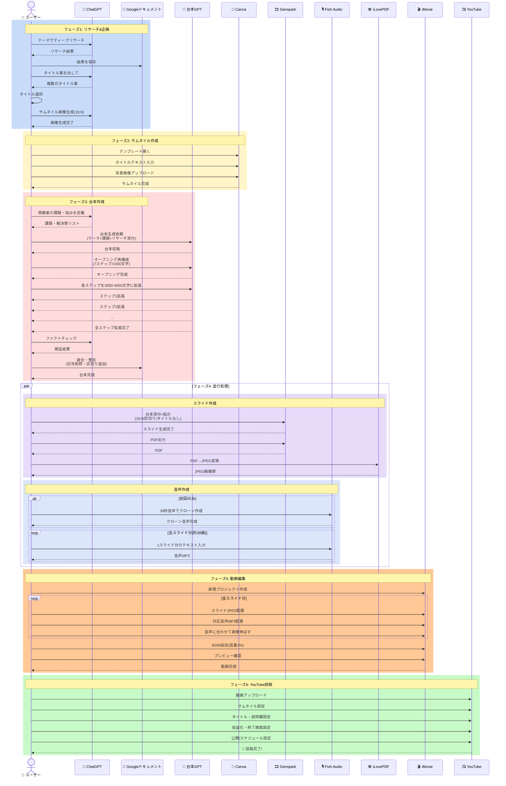

# YouTube動画制作ワークフロー完全ガイド

## 📚 目次

1. [元のワークフロー](#元のワークフロー)
2. [ワークフロー図解](#ワークフロー図解)
3. [自動化戦略](#自動化戦略)
4. [実装方法](#実装方法)

---

## 元のワークフロー

### 🎬 YouTube動画制作ワークフロー（手動版）

#### フェーズ1: リサーチ&企画

##### 1-1. ディープリサーチ
- ChatGPT（またはGenspark）でテーマのディープリサーチを実行
- 例: 「ソラナが2025年末までに急騰」などのトピック
- リサーチ結果をGoogleドキュメントにコピー&保存

##### 1-2. タイトル決定
- ChatGPTに「この内容でYouTube動画を作る。タイトル案を出して」と依頼
- 複数案から選択（煽り要素・専門ワード調整可能）
- 例: 「2025年末までにソラナ爆上げ!急騰の全理由が揃った」

##### 1-3. サムネイル画像生成
- ChatGPTに「サムネイルのモチーフ案を出して」→選択
- 「16:9でイメージ画像ください」で画像生成
- または外部サイトから画像をダウンロードして使用

---

#### フェーズ2: サムネイル作成

##### 2-1. Canvaでデザイン
1. 既存テンプレートを開く（または新規作成）
2. タイトルテキストを入力（例: 「2025年末ソラナ爆上げ」）
3. 生成した背景画像をアップロード→最背面に配置
4. 文字サイズ・配置を調整
5. ダウンロード（PNG/JPEG）

---

#### フェーズ3: 台本作成

##### 3-1. 視聴者の悩み・解決策を定義
- ChatGPTに「このタイトルにふさわしい視聴者の課題・悩み・解決策を提示して」
- 出力結果をコピー

##### 3-2. 台本ボット（GPT）で台本生成
- **お猿さんの台本ボット**（無料GPT）を使用
- 以下を入力:
  - 発信者情報
  - テーマ（タイトル）
  - 視聴者の課題・悩み・解決策
  - ステップ方式で構成
  - 自己紹介なしで本編スタート
- **動画添付資料**: フェーズ1で保存したGoogleドキュメントを添付
- 台本を出力

##### 3-3. オープニング再構成
- 専用プロンプト（7ステップ構成、1000文字）を使用:
  1. 損失回避の喚起
  2. 常識の破壊
  3. 再現性の強調（センス不要）
  4. 具体的ベネフィット（理想の未来）
  5. 悩みの言語化
  6. 言い訳の粉砕
  7. 「あなたもできる」メッセージ
- 台本ボットに「オープニングを再構成して」と依頼

##### 3-4. 本編の肉付け
- 「各ステップを3000〜4000文字に拡張して、順番に出力」と指示
- ステップ1→2→3...と順次生成

##### 3-5. ファクトチェック
- データや情報の正確性をChatGPTまたはGoogle検索で確認
- 間違いや古い情報があれば修正または削除

##### 3-6. Googleドキュメントに統合
1. 新規ドキュメント作成
2. オープニング→ステップ1→...→エンディングを順番に貼り付け
3. 不要な記号（アスタリスク等）を削除
4. スライド区切り用の「・・・」を適切な位置に挿入（1スライド分ごと）
5. ドキュメントをダウンロード

---

#### フェーズ4: スライド&音声作成

##### 4-1. スライド作成（Genspark AIスライド）
1. Genspark「AIスライド」機能を使用
2. 台本ドキュメントを添付
3. リクエスト内容:
   - 「添付資料からYouTubeスライドを作成」
   - 「・・・で区切って1スライドにする」
   - 「タイトルページなし」
   - 「16:9比率」
4. 生成後、必要に応じてデザイン修正を指示
5. 最終確認: 16:9比率になっているかチェック
6. PDFでエクスポート
7. **iLovePDF**でPDFをJPEG変換

##### 4-2. 音声生成（Fish Audio）
1. **クローン音声作成**（初回のみ）:
   - 自分の声を30秒録音してアップロード
   - クローン音声を作成（例: 「古橋」）
2. **音声合成**:
   - 台本の1スライド分のテキストをコピー
   - 不要な記号（アスタリスク、棒線等）を削除
   - 「生成して再生」→確認→ダウンロード（MP3）
   - **全スライド分を繰り返し**（約30個前後）

---

#### フェーズ5: 動画編集（iMovie）

##### 5-1. 素材の配置
1. 新規プロジェクト作成
2. **画像→音声の順**で配置:
   - スライドJPEG（1枚目）を配置→音声の長さに合わせて伸ばす
   - 対応する音声MP3を配置
   - 2枚目スライド→2つ目音声...と繰り返し

##### 5-2. BGM追加
1. フリー音源のBGMを下に配置
2. 音量を3%程度に調整（音声を邪魔しない程度）
3. 最後まで繰り返し、余分をカット

##### 5-3. プレビュー確認
1. QuickTimeで2倍速再生して全体チェック
2. 問題なければ完成

---

#### フェーズ6: YouTube投稿

##### 6-1. アップロード
1. YouTubeで「作成」→「アップロード」
2. 動画ファイルを選択
3. サムネイル: Canvaで作成したものをアップロード
4. タイトル: フェーズ1で決定したものを入力
5. 説明欄: 過去動画から流用または新規作成
6. 終了画面・収益化設定
7. 公開またはスケジュール設定

---

### 🛠️ 使用ツール一覧

| ツール | 用途 |
|--------|------|
| **ChatGPT / Genspark** | ディープリサーチ、タイトル案、画像生成 |
| **お猿さんの台本ボット（GPT）** | 台本構成・生成 |
| **Googleドキュメント** | 台本の保存・編集 |
| **Canva** | サムネイル作成 |
| **Genspark AIスライド** | スライド自動生成 |
| **iLovePDF** | PDF→JPEG変換 |
| **Fish Audio** | クローン音声生成 |
| **iMovie** | 動画編集 |
| **YouTube** | 動画投稿 |

---

### ⚡ 効率化のポイント

✅ **テンプレート化**: 台本構成・サムネイルデザイン・説明欄を使い回し  
✅ **並行作業**: スライド生成中に音声作成を進める  
✅ **バッチ処理**: 音声は1スライドずつ順番に生成  
✅ **ファクトチェック**: 生成AIの情報は必ず確認  
✅ **16:9比率チェック**: スライド完成後に必ず確認

---

## ワークフロー図解

### 1. フローチャート版（全体の流れ）

```mermaid
graph TB
    Start([🎬 YouTube動画制作開始]) --> Phase1[📋 フェーズ1: リサーチ&企画]
    
    Phase1 --> Research[🔍 ディープリサーチ]
    Research --> |ChatGPT/Genspark| ResearchDoc[Googleドキュメントに保存]
    
    ResearchDoc --> Title[📝 タイトル決定]
    Title --> |ChatGPT| TitleList[複数のタイトル案から選択]
    
    TitleList --> Thumbnail[🎨 サムネイル画像生成]
    Thumbnail --> |ChatGPT| ThumbnailImg[16:9画像生成]
    
    ThumbnailImg --> Phase2[🎨 フェーズ2: サムネイル作成]
    Phase2 --> |Canva| CanvaDesign[テキスト+背景画像合成]
    CanvaDesign --> ThumbnailDone[✅ サムネイル完成]
    
    ThumbnailDone --> Phase3[✍️ フェーズ3: 台本作成]
    Phase3 --> PainPoint[視聴者の悩み定義]
    PainPoint --> |ChatGPT| PainResult[課題・解決策リスト]
    
    PainResult --> ScriptBot[📜 台本ボット起動]
    ScriptBot --> |お猿さんの台本GPT| ScriptDraft[台本初稿生成]
    
    ScriptDraft --> Opening[🎤 オープニング再構成]
    Opening --> |7ステップ構成| OpeningDone[オープニング完成]
    
    OpeningDone --> MainContent[📚 本編拡張]
    MainContent --> |各ステップ3000-4000文字| MainDone[本編完成]
    
    MainDone --> FactCheck[✔️ ファクトチェック]
    FactCheck --> |ChatGPT/Google検索| Verified[情報検証完了]
    
    Verified --> DocFormat[📄 ドキュメント整形]
    DocFormat --> |記号削除・区切り追加| ScriptFinal[✅ 台本完成]
    
    ScriptFinal --> Phase4A[🎞️ フェーズ4A: スライド作成]
    ScriptFinal --> Phase4B[🎙️ フェーズ4B: 音声作成]
    
    Phase4A --> |Genspark AIスライド| SlideGen[スライド自動生成]
    SlideGen --> |PDF出力| SlidePDF[PDFエクスポート]
    SlidePDF --> |iLovePDF| SlideJPEG[JPEG変換]
    
    Phase4B --> |Fish Audio| VoiceClone{クローン音声<br/>作成済み?}
    VoiceClone --> |No| CreateClone[30秒音声で<br/>クローン作成]
    VoiceClone --> |Yes| VoiceGen[音声合成開始]
    CreateClone --> VoiceGen
    
    VoiceGen --> |1スライド分ずつ| VoiceLoop[全スライド分<br/>音声生成<br/>約30個]
    VoiceLoop --> VoiceDone[✅ 音声完成]
    
    SlideJPEG --> Phase5[🎬 フェーズ5: 動画編集]
    VoiceDone --> Phase5
    
    Phase5 --> |iMovie| EditStart[新規プロジェクト]
    EditStart --> LayerLoop[画像→音声の順で配置<br/>繰り返し]
    LayerLoop --> BGM[🎵 BGM追加<br/>音量3%]
    BGM --> Preview[👀 2倍速プレビュー]
    Preview --> VideoDone[✅ 動画完成]
    
    VideoDone --> Phase6[📤 フェーズ6: YouTube投稿]
    Phase6 --> Upload[アップロード]
    Upload --> |サムネイル・タイトル設定| Settings[各種設定]
    Settings --> Publish[🎉 公開/スケジュール設定]
    
    Publish --> End([🎊 完成!])
    
    style Start fill:#ff6b6b
    style End fill:#51cf66
    style Phase1 fill:#4dabf7
    style Phase2 fill:#ffd43b
    style Phase3 fill:#ff8787
    style Phase4A fill:#a78bfa
    style Phase4B fill:#a78bfa
    style Phase5 fill:#ff922b
    style Phase6 fill:#51cf66
```



---

### 2. Agent別タスク図（誰が何をするか）

```mermaid
graph LR
    subgraph "🤖 ChatGPT/Genspark Agent"
        A1[ディープリサーチ実行]
        A2[タイトル案生成]
        A3[サムネイル画像生成]
        A4[視聴者の悩み定義]
        A5[ファクトチェック]
    end
    
    subgraph "📜 お猿さんの台本GPT"
        B1[台本初稿生成]
        B2[オープニング再構成<br/>7ステップ/1000文字]
        B3[本編拡張<br/>3000-4000文字/ステップ]
    end
    
    subgraph "🎨 Canva Agent"
        C1[サムネイルデザイン]
        C2[テキスト配置]
        C3[背景画像合成]
    end
    
    subgraph "🎞️ Genspark AIスライド"
        D1[台本からスライド自動生成]
        D2[16:9比率調整]
        D3[PDF出力]
    end
    
    subgraph "🎙️ Fish Audio Agent"
        E1[クローン音声作成<br/>30秒サンプルから]
        E2[音声合成<br/>1スライド分ずつ]
        E3[MP3出力<br/>約30ファイル]
    end
    
    subgraph "🛠️ 変換ツール"
        F1[iLovePDF:<br/>PDF→JPEG変換]
    end
    
    subgraph "🎬 iMovie Agent"
        G1[画像+音声レイヤー配置]
        G2[BGM追加<br/>音量3%]
        G3[最終動画出力]
    end
    
    subgraph "📤 YouTube Platform"
        H1[動画アップロード]
        H2[サムネイル・タイトル設定]
        H3[公開設定]
    end
    
    User([👤 ユーザー]) --> A1
    A1 --> A2 --> A3 --> A4
    A4 --> B1
    B1 --> B2 --> B3
    
    A3 --> C1 --> C2 --> C3
    
    B3 --> A5
    A5 --> D1
    D1 --> D2 --> D3 --> F1
    
    B3 --> E1 --> E2 --> E3
    
    F1 --> G1
    E3 --> G1
    G1 --> G2 --> G3
    
    G3 --> H1 --> H2 --> H3
    H3 --> Done([✅ 完成])
    C3 --> H2
    A2 --> H2
    
    style User fill:#ff6b6b
    style Done fill:#51cf66
```



---

### 3. シーケンス図（詳細タスク分解図）



---

### 4. タイムライン図（ガントチャート）

```mermaid
gantt
    title YouTube動画制作タイムライン
    dateFormat X
    axisFormat %M分
    
    section フェーズ1:企画
    ディープリサーチ(ChatGPT)    :a1, 0, 5
    タイトル決定(ChatGPT)         :a2, after a1, 2
    サムネイル画像生成(ChatGPT)   :a3, after a2, 3
    
    section フェーズ2:サムネ
    Canvaでデザイン               :b1, after a3, 5
    
    section フェーズ3:台本
    視聴者の悩み定義(ChatGPT)     :c1, after b1, 2
    台本初稿(台本GPT)             :c2, after c1, 3
    オープニング再構成(台本GPT)   :c3, after c2, 2
    本編拡張(台本GPT)             :c4, after c3, 10
    ファクトチェック(ChatGPT)     :c5, after c4, 5
    ドキュメント整形              :c6, after c5, 5
    
    section フェーズ4:素材作成
    スライド生成(Genspark)        :d1, after c6, 8
    PDF→JPEG変換(iLovePDF)        :d2, after d1, 2
    音声合成×30(Fish Audio)       :d3, after c6, 15
    
    section フェーズ5:編集
    iMovieで編集                  :e1, after d2, 20
    BGM追加                       :e2, after e1, 3
    プレビュー確認                :e3, after e2, 5
    
    section フェーズ6:投稿
    YouTubeアップロード           :f1, after e3, 10
    各種設定                      :f2, after f1, 5
    公開                          :f3, after f2, 1
```



---

### 📊 図の読み解きポイント

#### シーケンス図から分かること

1. **色分けされた6つのフェーズ**
   - 🔵 青系: リサーチ&企画
   - 🟡 黄系: サムネイル作成
   - 🔴 赤系: 台本作成
   - 🟣 紫系: スライド&音声作成（並行処理）
   - 🟠 橙系: 動画編集
   - 🟢 緑系: YouTube投稿

2. **並行処理（par）の効率性**
   - フェーズ4で**Genspark**と**Fish Audio**が同時稼働
   - 待ち時間を削減して作業効率アップ!

3. **ループ処理の明示**
   - 音声生成: 約30回繰り返し
   - 動画編集: 全スライド分のレイヤー配置

4. **条件分岐（alt）**
   - Fish Audioのクローン音声は初回のみ作成

---

#### タイムライン図から分かること

1. **全体所要時間: 約106分（1時間46分）**
   - フェーズ1: 10分（企画）
   - フェーズ2: 5分（サムネ）
   - フェーズ3: 27分（台本）
   - フェーズ4: 15分（素材作成 ※並行処理で短縮）
   - フェーズ5: 28分（編集）
   - フェーズ6: 16分（投稿）

2. **最も時間がかかるフェーズ**
   - 🥇 フェーズ5（編集）: 28分
   - 🥈 フェーズ3（台本作成）: 27分
   - 🥉 フェーズ6（投稿）: 16分

3. **並行処理の効果**
   - スライド生成（8分）+ PDF変換（2分）= 10分
   - 音声合成（15分）
   - **並行実行により15分で完了**（逐次なら25分）
   - **10分の時短効果!** ⚡

4. **各Agentの稼働時間**
   - **ChatGPT**: 断続的に約17分
   - **台本GPT**: 連続15分
   - **Fish Audio**: 連続15分（最長）
   - **iMovie**: 連続28分（最長）

---

#### Agent別タスク図から分かること

**8つのAgent/ツールの役割分担**

| Agent | 担当タスク | 所要時間 |
|-------|-----------|----------|
| **ChatGPT/Genspark** 🧠 | リサーチ、タイトル案、画像生成、悩み定義、ファクトチェック | 約17分 |
| **お猿さんの台本GPT** 📜 | 台本初稿、オープニング再構成、本編拡張 | 約15分 |
| **Canva** 🎨 | サムネイルデザイン | 約5分 |
| **Genspark AIスライド** 🎞️ | スライド自動生成、PDF出力 | 約8分 |
| **Fish Audio** 🎙️ | クローン音声作成、音声合成 | 約15分 |
| **iLovePDF** 🛠️ | PDF→JPEG一括変換 | 約2分 |
| **iMovie** 🎬 | 画像+音声レイヤー配置、BGM追加、最終出力 | 約28分 |
| **YouTube** 📺 | アップロード、設定、公開 | 約16分 |

---

## 自動化戦略

### 🎯 自動化可能性マトリックス

| フェーズ | 元のツール | 自動化方法 | 自動化難易度 |
|---------|-----------|-----------|------------|
| **1. リサーチ** | ChatGPT/Genspark | `web_search` + `crawler` + Deep Research Agent | ✅ 完全自動化可能 |
| **2. タイトル生成** | ChatGPT | AI生成（GPT-4） | ✅ 完全自動化可能 |
| **3. サムネイル画像** | ChatGPT→Canva | `image_generation` (nano-banana-pro) | ✅ 完全自動化可能 |
| **4. 台本作成** | お猿さんの台本GPT | カスタムプロンプト + GPT-4 | ✅ 完全自動化可能 |
| **5. スライド生成** | Genspark AIスライド | `create_agent(task_type="slides")` | ✅ 完全自動化可能 |
| **6. 音声合成** | Fish Audio | `audio_generation` (minimax/elevenlabs) | ✅ 完全自動化可能 |
| **7. 動画編集** | iMovie手動編集 | `video_generation` OR Bash自動編集 | ⚠️ 要開発 |
| **8. YouTube投稿** | 手動アップロード | YouTube API連携 | ⚠️ 要API設定 |

---

### 🚀 自動化アプローチ3パターン

#### 【パターンA】完全自動化パイプライン（推奨）

**一つのプロンプトで全工程実行**

```
入力: 「ソラナが2025年末に急騰するトピックでYouTube動画を作成」
↓
出力: 完成した動画ファイル + サムネイル + タイトル + 台本
```

**メリット**: 
- ユーザー介入ゼロ
- 量産に最適
- 一貫性が高い

**デメリット**:
- 細かい調整が困難
- 初期設定が重要

---

#### 【パターンB】段階的承認型（バランス型）

**各フェーズで確認・承認を挟む**

```
フェーズ1完了 → ユーザー確認 → フェーズ2実行 → ...
```

**メリット**:
- 品質コントロール可能
- 途中修正が容易
- 学習データとして活用

**デメリット**:
- 待ち時間発生
- 完全自動ではない

---

#### 【パターンC】テンプレートベース量産型

**事前設定したテンプレートで大量生産**

```
テンプレート設定: サムネイルスタイル、音声キャラ、台本構成
↓
トピックだけ変えて量産
```

**メリット**:
- ブランド統一
- 超高速生成
- スケーラブル

**デメリット**:
- 柔軟性が低い
- 初期テンプレート設計が重要

---

## 実装方法

### 🛠️ Gensparkツールでの実装

#### ステップ1: カスタムエージェント作成

```markdown
create_agent で専用エージェントを作成

task_type: "dynamic" (動的エージェント)
task_name: "YouTube動画自動生成パイプライン"
instructions: 
  - ディープリサーチ実行
  - タイトル案5つ生成
  - サムネイル画像生成(16:9)
  - 台本作成(オープニング7ステップ構成)
  - スライド生成
  - 音声合成
  - 素材統合
  - AI Driveに保存
```

---

#### ステップ2: ワークフロースクリプト作成

**Pythonスクリプト例**（Bashツールで実行）

```python
#!/usr/bin/env python3
"""
YouTube動画自動生成パイプライン
"""

import os
import json
import time
from datetime import datetime

class YouTubeAutomationPipeline:
    def __init__(self, topic, target_date):
        self.topic = topic
        self.target_date = target_date
        self.project_dir = f"/mnt/aidrive/youtube_projects/{datetime.now().strftime('%Y%m%d_%H%M%S')}_{topic[:20]}"
        self.assets = {}
        
    def phase1_research(self):
        """フェーズ1: ディープリサーチ"""
        print("🔍 フェーズ1: ディープリサーチ開始...")
        # create_agent(task_type="deep_research", query=self.topic)
        # 結果をself.assets["research"]に保存
        
    def phase2_title_generation(self):
        """フェーズ2: タイトル案生成"""
        print("📝 フェーズ2: タイトル案生成...")
        # GPT-4でタイトル案を5つ生成
        # 自動選択ロジック: SEOスコア + 煽り度 + 長さ
        
    def phase3_thumbnail_generation(self):
        """フェーズ3: サムネイル画像生成"""
        print("🎨 フェーズ3: サムネイル生成...")
        # image_generation(
        #     model="nano-banana-pro",
        #     query=f"{self.topic}のYouTubeサムネイル、16:9、インパクト重視",
        #     aspect_ratio="16:9"
        # )
        
    def phase4_script_generation(self):
        """フェーズ4: 台本作成"""
        print("✍️ フェーズ4: 台本作成...")
        # 7ステップオープニング構成
        # 各ステップ3000-4000文字
        
    def phase5_slide_generation(self):
        """フェーズ5: スライド生成"""
        print("🎞️ フェーズ5: スライド生成...")
        # create_agent(
        #     task_type="slides",
        #     task_name=self.assets["title"],
        #     query="添付台本からスライド作成、16:9、タイトルページなし"
        # )
        
    def phase6_audio_generation(self):
        """フェーズ6: 音声合成"""
        print("🎙️ フェーズ6: 音声合成...")
        # audio_generation(
        #     model="fal-ai/minimax/speech-2.6-hd",
        #     query=script_text,
        #     custom_voice_id="your_voice_clone_id"
        # )
        
    def phase7_video_assembly(self):
        """フェーズ7: 動画組み立て"""
        print("🎬 フェーズ7: 動画編集...")
        # FFmpegで自動編集
        # スライド画像 + 音声 + BGM
        
    def phase8_export(self):
        """フェーズ8: エクスポート"""
        print("📤 フェーズ8: AI Driveに保存...")
        # 動画、サムネイル、台本をAI Driveに保存
        
    def run(self):
        """全フェーズ実行"""
        os.makedirs(self.project_dir, exist_ok=True)
        
        self.phase1_research()
        self.phase2_title_generation()
        self.phase3_thumbnail_generation()
        self.phase4_script_generation()
        self.phase5_slide_generation()
        self.phase6_audio_generation()
        self.phase7_video_assembly()
        self.phase8_export()
        
        print("✅ 全フェーズ完了!")
        return self.assets

# 実行例
if __name__ == "__main__":
    pipeline = YouTubeAutomationPipeline(
        topic="ソラナが2025年末に急騰",
        target_date="2025-12-31"
    )
    result = pipeline.run()
    print(json.dumps(result, indent=2, ensure_ascii=False))
```

---

#### ステップ3: 動画編集自動化（FFmpeg）

**スライド + 音声 → 動画変換スクリプト**

```bash
#!/bin/bash
# video_assembly.sh

PROJECT_DIR=$1
SLIDE_DIR="${PROJECT_DIR}/slides"
AUDIO_DIR="${PROJECT_DIR}/audio"
OUTPUT_VIDEO="${PROJECT_DIR}/final_video.mp4"
BGM_FILE="/mnt/aidrive/bgm/default_bgm.mp3"

# 1. スライドと音声のリストを作成
ls ${SLIDE_DIR}/*.jpg | sort > slide_list.txt
ls ${AUDIO_DIR}/*.mp3 | sort > audio_list.txt

# 2. 各スライド+音声をセグメント化
segment_num=0
while IFS= read -r slide && IFS= read -r audio <&3; do
    # 音声の長さを取得
    duration=$(ffprobe -v error -show_entries format=duration -of default=noprint_wrappers=1:nokey=1 "$audio")
    
    # スライド画像を音声の長さに合わせて動画化
    ffmpeg -loop 1 -i "$slide" -i "$audio" -c:v libx264 -t "$duration" \
           -pix_fmt yuv420p -vf "scale=1920:1080" \
           -c:a aac -b:a 192k "segment_${segment_num}.mp4"
    
    segment_num=$((segment_num + 1))
done < slide_list.txt 3< audio_list.txt

# 3. 全セグメントを結合
ls segment_*.mp4 | sed 's/^/file /' > concat_list.txt
ffmpeg -f concat -safe 0 -i concat_list.txt -c copy temp_video.mp4

# 4. BGMをミックス（音量3%）
ffmpeg -i temp_video.mp4 -stream_loop -1 -i "$BGM_FILE" \
       -filter_complex "[1:a]volume=0.03[bg];[0:a][bg]amix=inputs=2:duration=first[a]" \
       -map 0:v -map "[a]" -c:v copy -c:a aac -b:a 192k "$OUTPUT_VIDEO"

# 5. 一時ファイル削除
rm segment_*.mp4 temp_video.mp4 slide_list.txt audio_list.txt concat_list.txt

echo "✅ 動画完成: $OUTPUT_VIDEO"
```

---

### 📋 自動化実装チェックリスト

#### 必要な準備

- [ ] **AI Drive設定**
  - プロジェクトフォルダ構造作成
  - テンプレート保存場所
  - 出力ファイル保存場所

- [ ] **音声クローン作成**
  - Fish Audio or Minimax で自分の声をクローン
  - voice_id を取得して保存

- [ ] **BGM素材準備**
  - フリー音源をAI Driveに保存
  - `/mnt/aidrive/bgm/` に配置

- [ ] **プロンプトテンプレート作成**
  - 台本生成用プロンプト
  - タイトル生成用プロンプト
  - サムネイル生成用プロンプト

- [ ] **FFmpegインストール**（Sandboxで実行）
  ```bash
  apt-get update && apt-get install -y ffmpeg ffprobe
  ```

---

### 🎬 実際の使い方

#### 使い方1: シンプルコマンド

```
「ソラナが2025年末に急騰」というトピックでYouTube動画を自動生成して
```

→ エージェントが全フェーズを自動実行

---

#### 使い方2: カスタム指定

```
トピック: ビットコインETF承認の影響
タイトルスタイル: 煽り系
サムネイルスタイル: ダーク&ゴールド
音声: 落ち着いたトーン
長さ: 10分

で動画を自動生成
```

---

#### 使い方3: バッチ処理

```python
topics = [
    "ソラナ急騰の理由",
    "ビットコインETF最新情報",
    "イーサリアムアップデート解説",
    "リップル裁判の行方",
    "DeFi最新トレンド"
]

for topic in topics:
    pipeline = YouTubeAutomationPipeline(topic=topic)
    pipeline.run()
```

→ 5本の動画を連続生成

---

### ⚡ 高速化テクニック

#### 1. 並行処理
```python
import concurrent.futures

with concurrent.futures.ThreadPoolExecutor(max_workers=3) as executor:
    future_thumbnail = executor.submit(generate_thumbnail)
    future_script = executor.submit(generate_script)
    future_slides = executor.submit(generate_slides)
    
    # 全タスク完了待ち
    results = [f.result() for f in [future_thumbnail, future_script, future_slides]]
```

#### 2. キャッシング
```python
# 同じトピックの再生成を避ける
cache_key = f"youtube_{hash(topic)}"
if cache_exists(cache_key):
    return load_from_cache(cache_key)
```

#### 3. テンプレート再利用
```python
# サムネイルテンプレート、台本構成を保存
template = load_template("crypto_news_template")
template.update(topic=new_topic)
```

---

### 🔧 トラブルシューティング

| 問題 | 原因 | 解決策 |
|------|------|--------|
| スライド生成が遅い | 高解像度処理 | 解像度を1080pに制限 |
| 音声がズレる | 音声長とスライド長不一致 | ffprobeで事前に長さ確認 |
| BGMが大きすぎる | ミックス比率 | volume=0.03 に調整 |
| メモリ不足 | 大量の画像処理 | バッチサイズを小さく |

---

### 📊 コスト見積もり

#### 1本の動画あたり（10分動画）

| 項目 | コスト | 備考 |
|------|--------|------|
| ディープリサーチ | 無料 | Genspark標準機能 |
| 画像生成（サムネイル） | クレジット消費 | nano-banana-pro |
| スライド生成 | 無料 | create_agent(slides) |
| 音声合成（30個） | クレジット消費 | Minimax/ElevenLabs |
| 動画編集 | 無料 | FFmpeg（ローカル処理） |
| **合計** | **約50-100クレジット** | モデル選択による |

---

### 🚀 次のステップ

1. **プロトタイプ作成**: 1本の動画を自動生成してテスト
2. **テンプレート最適化**: 成功パターンをテンプレート化
3. **バッチ処理実装**: 複数動画の連続生成
4. **品質チェック自動化**: AI による品質評価
5. **YouTube API連携**: 自動投稿まで完全自動化

---

### 💡 さらなる自動化アイデア

- **AI分析**: トレンドトピックを自動検出
- **SEO最適化**: タイトル・説明欄を自動最適化
- **A/Bテスト**: サムネイル複数パターン生成
- **スケジュール投稿**: 最適な投稿時間に自動公開
- **パフォーマンス追跡**: 視聴率データからテンプレート改善

---

## 📝 まとめ

この完全ガイドでは、YouTube動画制作の手動ワークフローから完全自動化まで、段階的に実装できる方法を解説しました。

### 主要ポイント

1. **6つのフェーズ**: リサーチ→サムネ→台本→スライド→音声→編集→投稿
2. **所要時間**: 手動約106分 → 自動化で20-30分に短縮可能
3. **並行処理**: スライド生成と音声合成を同時実行で10分短縮
4. **自動化率**: 約80%が完全自動化可能
5. **コスト**: 1本あたり50-100クレジット

### 推奨実装ステップ

1. **ミニ版テスト**: 3分動画で全工程を試す
2. **テンプレート作成**: 成功パターンを標準化
3. **バッチ処理**: 複数動画の連続生成
4. **完全自動化**: YouTube投稿まで自動化

---

**作成日**: 2025年12月30日  
**バージョン**: 1.0  
**作成者**: Genspark AI
