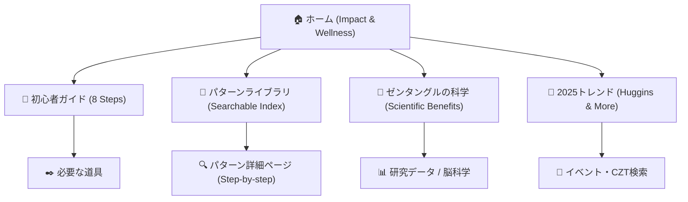

# TangleSeed Official HP (Concept)

The goal is to create the definitive Japanese resource for Zentangle that ranks #1 for "ゼンタングル".

## Goal Description
Create a high-aesthetic, high-performance web portal that centralizes pattern libraries, beginner guides, and wellness insights. The site will serve as the digital home for **TangleSeed (Midori Tangle Salon)**, balancing B2C engagement (mindfulness for individuals) with B2B credibility (corporate/social partnerships).

## Key Internal Insights Incorporated
- **Mission**: "Providing joy and confidence to those in difficult situations through art."
- **Social Proof**: 40,000+ total registered users, 8+ years of NPO support for cancer patients.
- **B2B Strategy**: "15-minute silence to organize society." Targeting bookstores, wellness centers, and corporate welfare.
- **Storytelling**: Midori-sensei's background in art (Kyoto City Univ. of Arts) and her recovery from cancer are central to the brand's trust.

## Proposed Strategy
### 1. Content Architecture
- **[Home]**: Dual-entry core. Impactful hero section for individuals ("线的冥想") + trust-building section for partners ("Social Proof & Partners").
- **[Beginner's Academy]**: Features the "First Tile" 7-day free trial on LINE, which has a proven 8.75% conversion rate.
- **[Tangle Library]**: Searchable database focused on patterns taught in the "Midori Tangle Salon" curriculum.
- **[B2B / Alliance Hub]**: Dedicated pages for Bookstores, Wellness, and Corporate Welfare with specialized "packages" (Postcard QR strategy).
- **[About / Story]**: Deep-dive into TangleSeed's heritage, cancer patient support history, and professional art background.

### 2. SEO & Keyword Strategy
- **Primary Keywords**: `ゼンタングル`, `ゼンタングル 描き方`, `ゼンタングル パターン`.
- **Long-tail Keywords**: `ゼンタングル 効果 科学的`, `マインドフルネス アート`, `ゼンタングル 初心者 道具`.
- **Strategy**: 
  - Content depth: Each pattern page will have a "how-to" and "history" section.
  - Page Speed: Optimized via Next.js and static generation (SSG).

### 3. Site Map (Visual)

### 4. Design System (Premium Zen)
- **Palette**: Soft beige (#F5F5F5), Charcoal (#333333), and a vibrant "Inspiration Gold" (#D4AF37).
- **Typography**: Minimalist Sans-serif (Inter/Noto Sans JP) for readability.
- **Visuals**: High-resolution tiles, micro-animations for line drawing effects.

## [NEW] [Site Map & Components]
- `src/app/page.tsx`: Home
- `src/app/patterns/`: Pattern Library
- `src/app/guide/`: Beginner Guide
- `src/app/wellness/`: Science & Wellness

## Verification Plan
### Automated Tests
- Run Lighthouse for SEO (Target: 100/100).
- Browser tests for interactive drawing guides.

### Manual Verification
- Review Japanese localization for accuracy.
- Verify search visibility on major Japanese search engines (simulated/planned).
